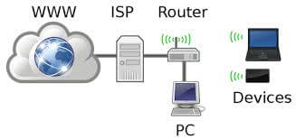
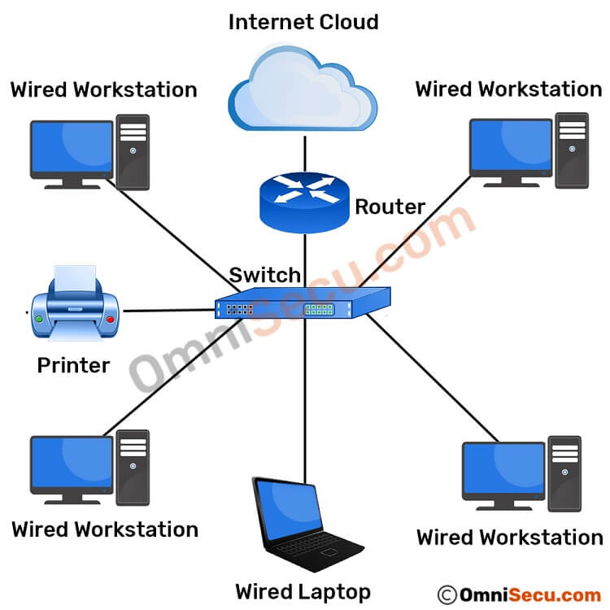
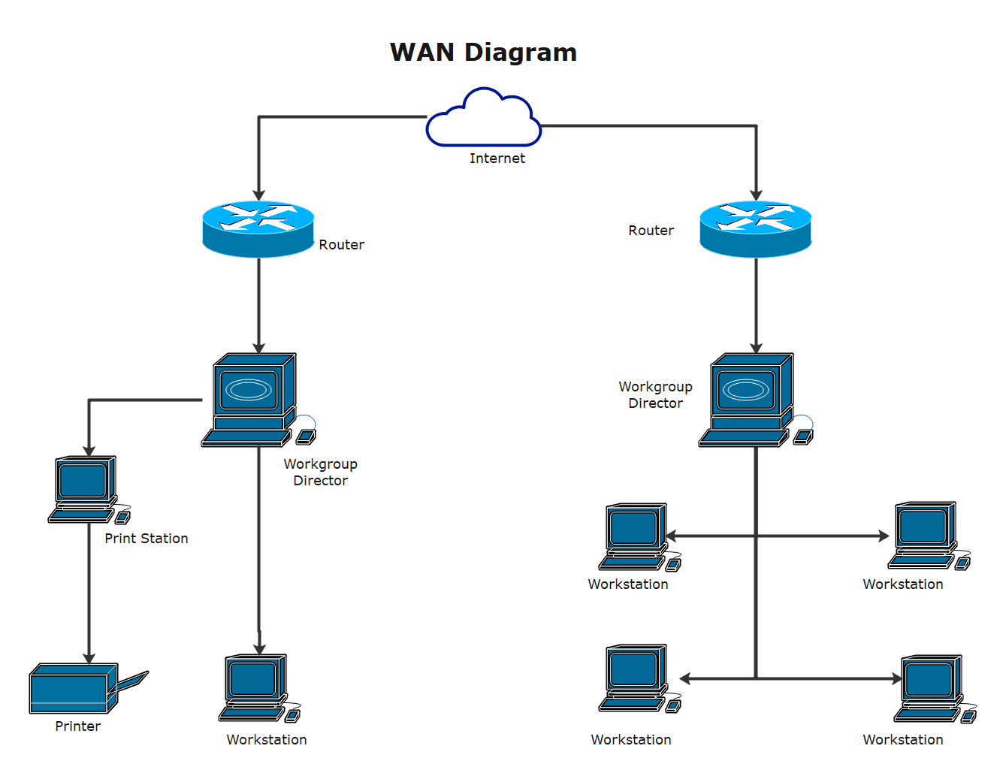
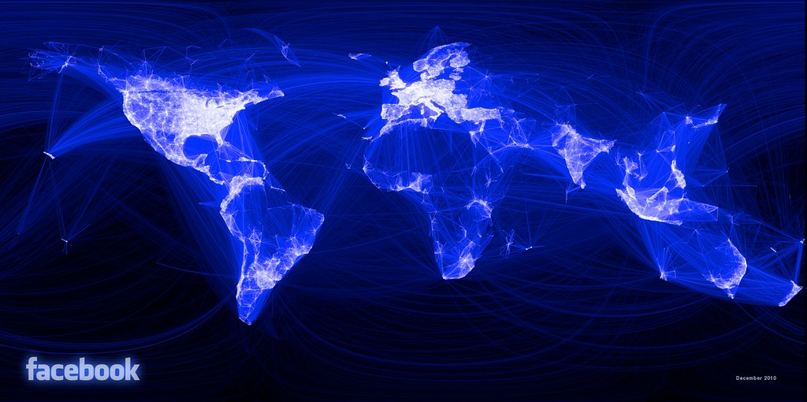

+++
title = 'Tipos de Redes'
date = '2024-10-23'
author = 'Eric J. Hernandez J.'
description = 'Repaso por los tipos de redes y dispositivos más comunes.'
categories = ['Redes']
tags = ['Redes', 'Tipos de Redes', 'Dispositivos Finales', 'Internet']
series = ['Ingeniería en Redes']
aliases = ['tipos-de-redes', 'tipos-redes-dispositivos', 'tipos-de-redes-y-dispositivos']
draft = false
+++

Podemos tener redes de **todos los tamaños y tipos**, desde redes con dos computadores hasta redes de miles de computadoras conectadas y moviendo información. Se les conoce como **SOHO (Small Office/Home Office)** a las redes instaladas en oficinas pequeñas, hogares y oficinas de casa. Las redes SOHO sirven para **compartir recursos como impresoras, imágenes, música y todo tipo de información**, entre los usuarios locales.

En negocios se usan **redes grandes** para la comunicación porque es **más eficiente y barato que otros medios** más antiguos o tradicionales como llamadas de teléfono. Las redes permiten implementar medios de comunicación más rápidos como **correo electrónico y mensajes**.

**Internet** es considerada como **"La Red de Redes"** porque literalmente está hecha de miles de redes locales interconectadas entre sí.

## Redes Domésticas Pequeñas

Este tipo de red se encarga de **conectar unos pocos dispositivos entre sí** y sirve también para **acceder a Internet**.

## Redes Pequeñas de Oficina y Oficinas Domésticas

Una red SOHO permite que las **computadoras en una oficina doméstica u oficina remota se conecten a una red corporativa** o compartan recursos.

## Redes Medianas y Grandes

Estas redes son usadas por **organizaciones grandes como empresas y escuelas**, pueden tener muchas ubicaciones con muchos dispositivos conectados entre sí.

## Redes Mundiales

**Internet es una red de redes que conecta cientos de millones de dispositivos** al rededor de todo el mundo.

## Dispositivos

Entre los dispositivos que podemos conectar a una red, podemos encontrar los más comunes como **teléfonos inteligentes (smartphones), tablets, relojes, lentes, sistemas de seguridad,  Smart TVs, consolas como Xbox, entre otros**.
